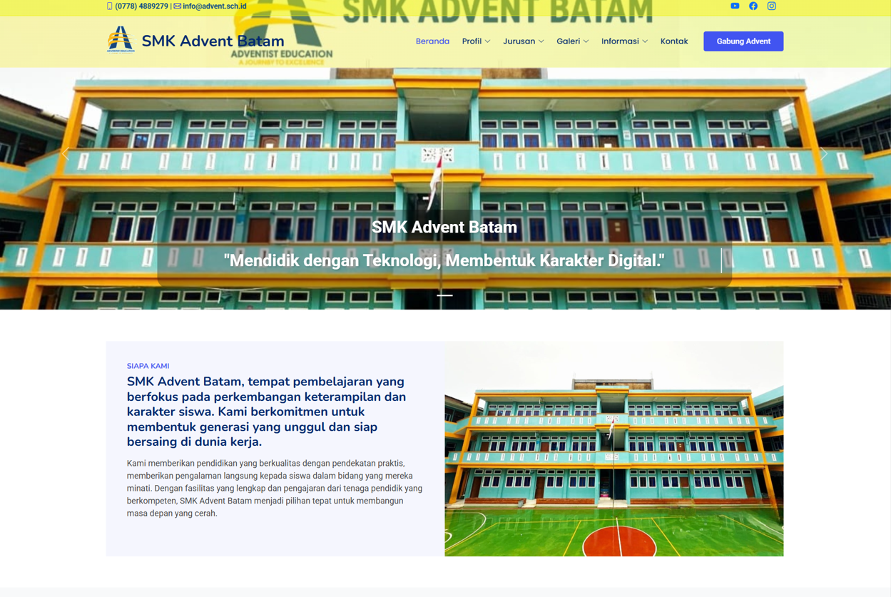

# SMKS Advent Batam – Company Profile Website

This project was developed as part of a team in an independent study program, focusing on building a company profile website for SMKS Advent Batam. The website aims to provide comprehensive and accessible information about the school, including its profile, academic programs, facilities, and activities. The goal is to create a digital platform that effectively represents the institution and can be accessed by students, parents, and the general public. The development process involved organizing content in a structured manner and designing a layout that enhances readability and navigation. Emphasis was placed on combining visual design with functionality to ensure the website is both informative and user-friendly. This project demonstrates the ability to collaborate within a team while developing a complete web solution to support institutional needs.

## 📸 Website Preview

